# 🏥 Disease Prediction Model

> **A Machine Learning approach to predict diseases based on symptoms using advanced classification algorithms**

[](https://www.python.org/)
[](https://scikit-learn.org/)
[](https://pandas.pydata.org/)

---

## 📊 Project Overview

This project implements a comprehensive machine learning pipeline for **disease classification** based on patient symptoms. Using a dataset of over 5,000 medical records, the model can predict potential diagnoses with high accuracy through advanced feature engineering and ensemble methods.

### ✨ Key Features

- 🔍 **Intelligent Symptom Analysis** - Processes 131+ unique symptoms
- 🧠 **Advanced ML Models** - Random Forest, Decision Tree & K-Nearest Neighbors classifiers
- 📈 **Dimensionality Reduction** - PCA optimization for better performance
- ⚙️ **Hyperparameter Tuning** - GridSearchCV for optimal model performance
- 📋 **Comprehensive Evaluation** - Detailed accuracy metrics and comparisons
- 🎯 **Clustering Analysis** - K-means clustering of disease patterns

---

## 🎯 Results Summary

We used the balanced accuracy, precision, recall, and F1-score performance metrics to analyze and compare the capabilities of each of the six models that were created. As shown in figure 7, all of the models except for the non-PCA random forest and non-PCA decision tree performed relatively the same across all four of the performance metrics. The PCA random forest model had the highest values across all the performance metrics with .942, .946, .942, and .943 for balanced accuracy, precision, recall, and F1-score, respectively. The non-PCA random forest model had metrics in the high .8x range, and the non-PCA decision tree performed the worst with metrics in the low .6x range.

### 🔍 Performance Analysis

**Differences In Performance:**
Any differences in the performance across the models can be accounted for in a couple different ways.

Firstly, the principal component analysis that was performed increased the performance of the random forest and decision tree models that used it compared to the random forest and decision tree models that did not. The performance metrics support this. Since there were no other large differences in how these pairs models were created other than in the use of principal component analysis, it takes the credit for the performance difference.

Secondly, the three model types that were used have inherently different architectures, and the hyperparameters that were tuned were not all the same across these types. This means that they were all making predictions in different ways, so it is intuitive that they would not all be coming to exactly the same conclusions.

### 🏆 Model Advantages And Disadvantages

**Random Forest Models:** Have the advantage of being an ensemble method. They use multiple decision trees and average their outputs to come to a solution. This is better than using just a single model because it is more powerful and there is less of a chance of the final outputs being inaccurate.

**Decision Tree Models:** Do not have any notable advantages over the other models. They are overshadowed by the random forest models which have a clear superiority over them due to being an ensemble method. Furthermore, decision trees have the big issue of being prone to overfitting.

**K-Nearest Neighbor Models:** Have the advantage of not having any training time since they are lazy learning algorithms. However, they can require a lot of extra time when making predictions compared to the other model types, which is a disadvantage in time-sensitive medical environments.

### 🎯 Final Model Recommendation

**We recommend using the Random Forest model created with Principal Component Analysis.** This recommendation is backed by its superior performance metrics and clear advantages over the other model types. It is more powerful and future-proof compared to decision tree models, and faster in making predictions than k-nearest neighbor models.

---

## 🚀 Quick Start

### Prerequisites
```bash
pip install pandas numpy scikit-learn matplotlib
```

### Running the Model
```bash
python DiseasePrediction/Disease_Prediction.py
```

---

## 🔬 Technical Approach

### 1. **Data Processing** 📋
- **Dataset**: 5,362 medical records with symptoms and diagnoses
- **Feature Engineering**: One-hot encoding of 131 unique symptoms
- **Data Split**: 80/20 train-test split with stratification

### 2. **Dimensionality Reduction** 📉
- **PCA Implementation**: Reduced to 40 components
- **Variance Explained**: ~99.9% of original variance retained
- **Performance**: Optimized feature space for faster training

### 3. **Machine Learning Models** 🤖

#### Random Forest Classifier
- **Hyperparameters**: Criterion, n_estimators, max_depth
- **Cross-Validation**: 6-fold CV for robust evaluation
- **Performance**: High accuracy with ensemble voting

#### Decision Tree Classifier
- **Hyperparameters**: Criterion, min_samples_split, max_depth
- **Optimization**: GridSearchCV for parameter tuning
- **Comparison**: Baseline model for ensemble validation

#### K-Nearest Neighbors (KNN)
- **Hyperparameters**: n_neighbors (tested k=1 to k=30)
- **Optimization**: Performance comparison across neighbor counts
- **Analysis**: Lazy learning algorithm with prediction-time trade-offs

### 4. **Clustering Analysis** 🎯
- **K-means Clustering**: Disease pattern identification
- **Cluster Optimization**: Silhouette analysis for optimal k=8
- **Visualization**: 3D PCA scatter plots with cluster assignments

---

## 📈 Results & Performance

| Model | Feature Space | Balanced Accuracy | Precision | Recall | F1-Score |
|-------|---------------|------------------|-----------|--------|----------|
| **Random Forest** | **PCA** | **0.942** | **0.946** | **0.942** | **0.943** |
| Decision Tree | PCA | High | High | High | High |
| KNN | PCA | High | High | High | High |
| Random Forest | Original | 0.8x range | 0.8x range | 0.8x range | 0.8x range |
| Decision Tree | Original | 0.6x range | 0.6x range | 0.6x range | 0.6x range |
| KNN | Original | Competitive | Competitive | Competitive | Competitive |

### 🎯 Key Insights
- **PCA Effectiveness**: Significantly improves model performance across all algorithms
- **Ensemble Advantage**: Random Forest outperforms single Decision Tree and KNN
- **Feature Importance**: Successfully identifies critical symptom patterns
- **Clustering Success**: Meaningful disease groupings with k=8 clusters

---

## 📁 Project Structure

```
DiseasePredictionModel/
├── DiseasePrediction/
│   ├── Disease_Prediction.py    # Main model implementation
│   └── diagnosis_and_symptoms.csv    # Dataset (add your data here)
└── README.md
```

---

## 🛠️ Technical Stack

<p align="center">
  
  
  
  
  
</p>

---

## 🔧 Installation & Setup

1. **Clone the repository**
   ```bash
   git clone https://github.com/yourusername/DiseasePredictionModel.git
   cd DiseasePredictionModel
   ```

2. **Install dependencies**
   ```bash
   pip install -r requirements.txt
   ```

3. **Add your dataset**
   - Place your `diagnosis_and_symptoms.csv` file in the `DiseasePrediction/` directory
   - Ensure the CSV format matches the expected structure

4. **Run the model**
   ```bash
   python DiseasePrediction/Disease_Prediction.py
   ```

---

## 📊 Model Workflow

```mermaid
graph TD
    A[📊 Load Dataset] --> B[🔄 Data Processing]
    B --> C[🏗️ Feature Engineering]
    C --> D[📉 PCA Reduction]
    D --> E[🔀 Train-Test Split]
    E --> F[🤖 Model Training]
    F --> G[⚙️ Hyperparameter Tuning]
    G --> H[📈 Model Evaluation]
    H --> I[🎯 Performance Comparison]
    I --> J[🔍 Clustering Analysis]
    J --> K[📋 Final Recommendations]
```



---

## 🎓 Academic Context

This project was developed as part of **ENGR 100** coursework, demonstrating:
- **Data Science Fundamentals**
- **Machine Learning Pipeline Design**
- **Statistical Analysis & Validation**
- **Healthcare Technology Applications**
- **Comparative Model Analysis**

**Team Members**: Sameer Singh, Joe Marcotte, Ian Nadeau, Sriram Kumaran

---

## 🔍 Future Enhancements

- [ ] **Deep Learning Models** - Neural network implementation
- [ ] **Real-time Prediction** - Web API for live diagnosis
- [ ] **Expanded Dataset** - Integration with larger medical databases
- [ ] **Feature Visualization** - Interactive symptom importance plots
- [ ] **Model Interpretability** - SHAP values for prediction explanations
- [ ] **Cross-validation Analysis** - More robust model validation
- [ ] **Ensemble Methods** - Combining multiple algorithms for better predictions

---

## 🤝 Contributing

Contributions are welcome! Please feel free to submit a Pull Request. For major changes, please open an issue first to discuss what you would like to change.

---

<p align="center">
  <strong>⭐ Star this repository if you found it helpful!</strong>
</p>

<p align="center">
  Made with ❤️ for advancing healthcare through machine learning
</p> 