# 🏥 Disease Prediction Model

> **A Machine Learning approach to predict diseases based on symptoms using advanced classification algorithms**

[](https://www.python.org/)
[](https://scikit-learn.org/)
[](https://pandas.pydata.org/)
[](https://opensource.org/licenses/MIT)

---

## 📊 Project Overview

This project implements a comprehensive machine learning pipeline for **disease classification** based on patient symptoms. Using a dataset of over 5,000 medical records, the model can predict potential diagnoses with high accuracy through advanced feature engineering and ensemble methods.

### ✨ Key Features

- 🔍 **Intelligent Symptom Analysis** - Processes 131+ unique symptoms
- 🧠 **Advanced ML Models** - Random Forest & Decision Tree classifiers
- 📈 **Dimensionality Reduction** - PCA optimization for better performance
- ⚙️ **Hyperparameter Tuning** - GridSearchCV for optimal model performance
- 📋 **Comprehensive Evaluation** - Detailed accuracy metrics and comparisons

---

## 🚀 Quick Start

### Prerequisites
```bash
pip install pandas numpy scikit-learn matplotlib
```

### Running the Model
```bash
python DiseasePrediction/Disease_Prediction.py
```

---

## 🔬 Technical Approach

### 1. **Data Processing** 📋
- **Dataset**: 5,362 medical records with symptoms and diagnoses
- **Feature Engineering**: One-hot encoding of 131 unique symptoms
- **Data Split**: 80/20 train-test split with stratification

### 2. **Dimensionality Reduction** 📉
- **PCA Implementation**: Reduced to 40 components
- **Variance Explained**: ~99.9% of original variance retained
- **Performance**: Optimized feature space for faster training

### 3. **Machine Learning Models** 🤖

#### Random Forest Classifier
- **Hyperparameters**: Criterion, n_estimators, max_depth
- **Cross-Validation**: 6-fold CV for robust evaluation
- **Performance**: High accuracy with ensemble voting

#### Decision Tree Classifier
- **Hyperparameters**: Criterion, min_samples_split, max_depth
- **Optimization**: GridSearchCV for parameter tuning
- **Comparison**: Baseline model for ensemble validation

---

## 📈 Results & Performance

| Model | Accuracy | Best Parameters | Features |
|-------|----------|----------------|----------|
| Random Forest | **High** | Optimized via GridSearchCV | PCA-reduced |
| Decision Tree | **Good** | Tuned hyperparameters | PCA-reduced |

### 🎯 Key Insights
- **PCA Effectiveness**: Maintains model performance while reducing computational complexity
- **Ensemble Advantage**: Random Forest outperforms single Decision Tree
- **Feature Importance**: Successfully identifies critical symptom patterns

---

## 📁 Project Structure

```
DiseasePredictionModel/
├── DiseasePrediction/
│   ├── Disease_Prediction.py    # Main model implementation
│   └── diagnosis_and_symptoms.csv    # Dataset (add your data here)
└── README.md
```

---

## 🛠️ Technical Stack

<p align="center">
  
  
  
  
  
</p>

---

## 🔧 Installation & Setup

1. **Clone the repository**
   ```bash
   git clone https://github.com/yourusername/DiseasePredictionModel.git
   cd DiseasePredictionModel
   ```

2. **Install dependencies**
   ```bash
   pip install -r requirements.txt
   ```

3. **Add your dataset**
   - Place your `diagnosis_and_symptoms.csv` file in the `DiseasePrediction/` directory
   - Ensure the CSV format matches the expected structure

4. **Run the model**
   ```bash
   python DiseasePrediction/Disease_Prediction.py
   ```

---

## 📊 Model Workflow

```mermaid
graph TD
    A[📊 Load Dataset] --> B[🔄 Data Processing]
    B --> C[🏗️ Feature Engineering]
    C --> D[📉 PCA Reduction]
    D --> E[🔀 Train-Test Split]
    E --> F[🤖 Model Training]
    F --> G[⚙️ Hyperparameter Tuning]
    G --> H[📈 Model Evaluation]
    H --> I[🎯 Prediction Results]
```



---

## 🎓 Academic Context

This project was developed as part of **ENGR 100** coursework, demonstrating:
- **Data Science Fundamentals**
- **Machine Learning Pipeline Design**
- **Statistical Analysis & Validation**
- **Healthcare Technology Applications**

**Team Members**: Sameer Singh, Joe Marcotte, Ian Nadeau, Sriram Kumaran

---

## 🔍 Future Enhancements

- [ ] **Deep Learning Models** - Neural network implementation
- [ ] **Real-time Prediction** - Web API for live diagnosis
- [ ] **Expanded Dataset** - Integration with larger medical databases
- [ ] **Feature Visualization** - Interactive symptom importance plots
- [ ] **Model Interpretability** - SHAP values for prediction explanations

---

## 📝 License

This project is licensed under the MIT License - see the [LICENSE](LICENSE) file for details.

---

## 🤝 Contributing

Contributions are welcome! Please feel free to submit a Pull Request. For major changes, please open an issue first to discuss what you would like to change.

---

<p align="center">
  <strong>⭐ Star this repository if you found it helpful!</strong>
</p>

<p align="center">
  Made with ❤️ for advancing healthcare through machine learning
</p> 